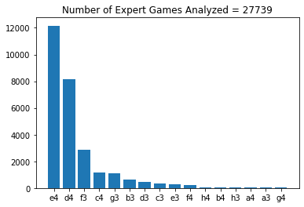
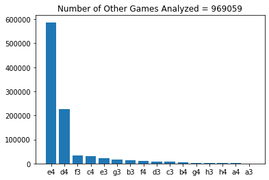
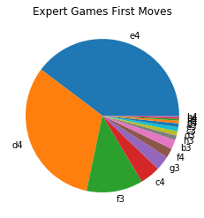
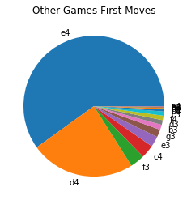

# Chess Database, To be Continued...

The online chess website https://lichess.org/ keeps a database of all the games played on its site, which can be found at https://database.lichess.org/.  I have downloaded the portable game notation (PGN) of every game played during Feb 2017, which amounts to over 10 million chess games.  This is a work in progress, but I will extract meaningful insights from this large dataset.

## Openings of "Expert" Players vs "Non-Expert" Players

LiChess uses its own Elo rating system to determine a players skill level.  The higher the rating, the stronger the chess player is assumed to be.  Any player with a rating of 2200+ will be considered an "expert" for the sake of segmentation.

After importing the packages we need (including the useful PGN parser chess), we can parse all the PGNs of the 10+ million chess games.


```python
import chess
import chess.pgn
import matplotlib.pyplot as plt
from collections import Counter
import time
```


```python
pgn = open("lichess_db_standard_rated_2017_02.pgn", 'r')
```

To get an idea of what the format is, below is the first game in the dataset printed.


```python
print(chess.pgn.read_game(pgn))
```

    [Event "Rated Classical game"]
    [Site "https://lichess.org/ntf4qW5C"]
    [Date "????.??.??"]
    [Round "?"]
    [White "cocinda"]
    [Black "mehran35"]
    [Result "0-1"]
    [BlackElo "1827"]
    [BlackRatingDiff "+6"]
    [ECO "B01"]
    [Opening "Scandinavian Defense"]
    [Termination "Normal"]
    [TimeControl "300+8"]
    [UTCDate "2017.01.31"]
    [UTCTime "23:00:01"]
    [WhiteElo "1627"]
    [WhiteRatingDiff "-6"]
    
    1. e4 d5 2. f3 d4 3. d3 e5 4. h4 Nc6 5. a3 a6 6. g3 f5 7. exf5 Bxf5 8. g4 Bd7 9. h5 Bd6 10. Be2 e4 11. f4 e3 12. f5 Bg3+ 13. Kf1 Qg5 14. Nh3 Qf6 15. Kg2 Qe5 16. c3 Nh6 17. cxd4 Nxd4 18. Nc3 Bc6+ 19. Kf1 Bxh1 20. Ne4 Bxe4 21. dxe4 Qxe4 22. Qa4+ c6 23. Ng1 Nxg4 24. Nf3 O-O-O 25. Kg2 Bf2 26. b3 Ne5 27. Bb2 Qg4+ 28. Kh2 Qg3+ 29. Kh1 Ndxf3 30. Bxe5 Qh3+ 31. Bh2 Qxh2# 0-1
    

Now we will parse through the dataset and store the first move (if a move was played) for experts and non-experts alike.


```python
expert_games_data = []
other_games_data = []

number_expert_games = 0
number_other_games = 0

start_time = time.time()

for i in range(1000000):
    match = chess.pgn.read_game(pgn)
    moves = [move for move in match.mainline_moves()]
    if moves != []:
        first_move = moves[0]
        white_first_move = str(first_move)[2:]
        if int(match.headers["WhiteElo"]) >= 2200:
            expert_games_data.append(white_first_move)
            number_expert_games += 1
        else:
            other_games_data.append(white_first_move)
            number_other_games += 1
    
total_time = time.time() - start_time
print("Total execution time = " + str(round(total_time/60,2)) + " minutes")
```

    Total execution time = 48.73 minutes
    

Lets create two histograms and two pie charts to view the data collected.


```python
count_expert = dict(Counter(expert_games_data).most_common())
count_other = dict(Counter(other_games_data).most_common())

plt.figure()
plt.bar(count_expert.keys(),count_expert.values())
plt.title("Number of Expert Games Analyzed = " + str(number_expert_games))

plt.figure()
plt.bar(count_other.keys(), count_other.values())
plt.title("Number of Other Games Analyzed = " + str(number_other_games))
```


    Text(0.5, 1.0, 'Number of Other Games Analyzed = 969059')








```python
plt.figure()
plt.pie(count_expert.values(),labels = count_expert.keys())
plt.title("Expert Games First Moves")

plt.figure()
plt.pie(count_other.values(),labels = count_other.keys())
plt.title("Other Games First Moves")
```


    Text(0.5, 1.0, 'Other Games First Moves')







