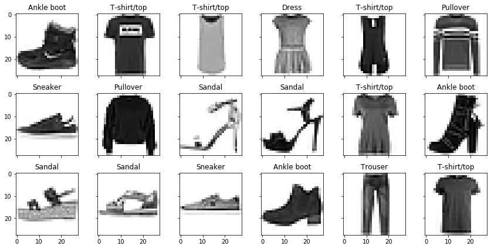
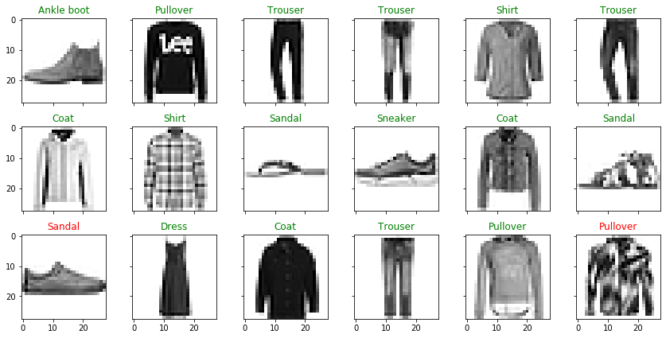

## Machine Learning Image Classification
I will use the Fashion MNIST data set obtained from https://github.com/zalandoresearch/fashion-mnist.  Each image is a 28x28 grayscale image corresponding to one of 10 different articles of clothing.  I will use tensorflow to create a machine learning model that classifies each image.

First, I import tensorflow and the other libraries needed.


```python
pip install tensorflow
```

    Collecting tensorflow
      Downloading tensorflow-2.3.0-cp37-cp37m-win_amd64.whl (342.5 MB)
    Collecting tensorflow-estimator<2.4.0,>=2.3.0
      Downloading tensorflow_estimator-2.3.0-py2.py3-none-any.whl (459 kB)
    Requirement already satisfied: six>=1.12.0 in c:\users\weldm\anaconda3\lib\site-packages (from tensorflow) (1.14.0)
    Collecting keras-preprocessing<1.2,>=1.1.1
      Downloading Keras_Preprocessing-1.1.2-py2.py3-none-any.whl (42 kB)
    Collecting opt-einsum>=2.3.2
      Downloading opt_einsum-3.3.0-py3-none-any.whl (65 kB)
    Collecting tensorboard<3,>=2.3.0
      Downloading tensorboard-2.3.0-py3-none-any.whl (6.8 MB)
    Collecting scipy==1.4.1
      Downloading scipy-1.4.1-cp37-cp37m-win_amd64.whl (30.9 MB)
    Collecting grpcio>=1.8.6
      Downloading grpcio-1.31.0-cp37-cp37m-win_amd64.whl (2.4 MB)
    Collecting h5py<2.11.0,>=2.10.0
      Downloading h5py-2.10.0-cp37-cp37m-win_amd64.whl (2.5 MB)
    Collecting protobuf>=3.9.2
      Downloading protobuf-3.13.0-cp37-cp37m-win_amd64.whl (1.0 MB)
    Requirement already satisfied: wrapt>=1.11.1 in c:\users\weldm\anaconda3\lib\site-packages (from tensorflow) (1.12.1)
    Collecting absl-py>=0.7.0
      Downloading absl_py-0.10.0-py3-none-any.whl (127 kB)
    Collecting gast==0.3.3
      Downloading gast-0.3.3-py2.py3-none-any.whl (9.7 kB)
    Collecting numpy<1.19.0,>=1.16.0
      Downloading numpy-1.18.5-cp37-cp37m-win_amd64.whl (12.7 MB)
    Requirement already satisfied: wheel>=0.26 in c:\users\weldm\anaconda3\lib\site-packages (from tensorflow) (0.34.2)
    Collecting google-pasta>=0.1.8
      Downloading google_pasta-0.2.0-py3-none-any.whl (57 kB)
    Collecting astunparse==1.6.3
      Downloading astunparse-1.6.3-py2.py3-none-any.whl (12 kB)
    Collecting termcolor>=1.1.0
      Downloading termcolor-1.1.0.tar.gz (3.9 kB)
    Collecting google-auth<2,>=1.6.3
      Downloading google_auth-1.20.1-py2.py3-none-any.whl (91 kB)
    Requirement already satisfied: requests<3,>=2.21.0 in c:\users\weldm\anaconda3\lib\site-packages (from tensorboard<3,>=2.3.0->tensorflow) (2.23.0)
    Requirement already satisfied: setuptools>=41.0.0 in c:\users\weldm\anaconda3\lib\site-packages (from tensorboard<3,>=2.3.0->tensorflow) (46.1.3.post20200330)
    Collecting markdown>=2.6.8
      Downloading Markdown-3.2.2-py3-none-any.whl (88 kB)
    Collecting tensorboard-plugin-wit>=1.6.0
      Downloading tensorboard_plugin_wit-1.7.0-py3-none-any.whl (779 kB)
    Collecting google-auth-oauthlib<0.5,>=0.4.1
      Downloading google_auth_oauthlib-0.4.1-py2.py3-none-any.whl (18 kB)
    Requirement already satisfied: werkzeug>=0.11.15 in c:\users\weldm\anaconda3\lib\site-packages (from tensorboard<3,>=2.3.0->tensorflow) (1.0.1)
    Collecting rsa<5,>=3.1.4; python_version >= "3.5"
      Downloading rsa-4.6-py3-none-any.whl (47 kB)
    Requirement already satisfied: pyasn1-modules>=0.2.1 in c:\users\weldm\anaconda3\lib\site-packages (from google-auth<2,>=1.6.3->tensorboard<3,>=2.3.0->tensorflow) (0.2.2)
    Collecting cachetools<5.0,>=2.0.0
      Downloading cachetools-4.1.1-py3-none-any.whl (10 kB)
    Requirement already satisfied: chardet<4,>=3.0.2 in c:\users\weldm\anaconda3\lib\site-packages (from requests<3,>=2.21.0->tensorboard<3,>=2.3.0->tensorflow) (3.0.4)
    Requirement already satisfied: certifi>=2017.4.17 in c:\users\weldm\anaconda3\lib\site-packages (from requests<3,>=2.21.0->tensorboard<3,>=2.3.0->tensorflow) (2020.4.5.1)
    Requirement already satisfied: urllib3!=1.25.0,!=1.25.1,<1.26,>=1.21.1 in c:\users\weldm\anaconda3\lib\site-packages (from requests<3,>=2.21.0->tensorboard<3,>=2.3.0->tensorflow) (1.25.8)
    Requirement already satisfied: idna<3,>=2.5 in c:\users\weldm\anaconda3\lib\site-packages (from requests<3,>=2.21.0->tensorboard<3,>=2.3.0->tensorflow) (2.9)
    Requirement already satisfied: importlib-metadata; python_version < "3.8" in c:\users\weldm\anaconda3\lib\site-packages (from markdown>=2.6.8->tensorboard<3,>=2.3.0->tensorflow) (1.5.0)
    Collecting requests-oauthlib>=0.7.0
      Downloading requests_oauthlib-1.3.0-py2.py3-none-any.whl (23 kB)
    Requirement already satisfied: pyasn1>=0.1.3 in c:\users\weldm\anaconda3\lib\site-packages (from rsa<5,>=3.1.4; python_version >= "3.5"->google-auth<2,>=1.6.3->tensorboard<3,>=2.3.0->tensorflow) (0.4.4)
    Requirement already satisfied: zipp>=0.5 in c:\users\weldm\anaconda3\lib\site-packages (from importlib-metadata; python_version < "3.8"->markdown>=2.6.8->tensorboard<3,>=2.3.0->tensorflow) (3.1.0)
    Collecting oauthlib>=3.0.0
      Downloading oauthlib-3.1.0-py2.py3-none-any.whl (147 kB)
    Building wheels for collected packages: termcolor
      Building wheel for termcolor (setup.py): started
      Building wheel for termcolor (setup.py): finished with status 'done'
      Created wheel for termcolor: filename=termcolor-1.1.0-py3-none-any.whl size=4835 sha256=0b61833927fbb4bf374ce25f879e66ff01714048f654f240ff42029186c14903
      Stored in directory: c:\users\weldm\appdata\local\pip\cache\wheels\3f\e3\ec\8a8336ff196023622fbcb36de0c5a5c218cbb24111d1d4c7f2
    Successfully built termcolor
    Installing collected packages: tensorflow-estimator, numpy, keras-preprocessing, opt-einsum, rsa, cachetools, google-auth, markdown, absl-py, protobuf, tensorboard-plugin-wit, oauthlib, requests-oauthlib, google-auth-oauthlib, grpcio, tensorboard, scipy, h5py, gast, google-pasta, astunparse, termcolor, tensorflow
      Attempting uninstall: numpy
        Found existing installation: numpy 1.15.4
        Uninstalling numpy-1.15.4:
          Successfully uninstalled numpy-1.15.4
      Attempting uninstall: scipy
        Found existing installation: scipy 1.1.0
        Uninstalling scipy-1.1.0:
          Successfully uninstalled scipy-1.1.0
      Attempting uninstall: h5py
        Found existing installation: h5py 2.8.0
        Uninstalling h5py-2.8.0:
          Successfully uninstalled h5py-2.8.0
    Successfully installed absl-py-0.10.0 astunparse-1.6.3 cachetools-4.1.1 gast-0.3.3 google-auth-1.20.1 google-auth-oauthlib-0.4.1 google-pasta-0.2.0 grpcio-1.31.0 h5py-2.10.0 keras-preprocessing-1.1.2 markdown-3.2.2 numpy-1.18.5 oauthlib-3.1.0 opt-einsum-3.3.0 protobuf-3.13.0 requests-oauthlib-1.3.0 rsa-4.6 scipy-1.4.1 tensorboard-2.3.0 tensorboard-plugin-wit-1.7.0 tensorflow-2.3.0 tensorflow-estimator-2.3.0 termcolor-1.1.0
    Note: you may need to restart the kernel to use updated packages.
    


```python
from __future__ import absolute_import, division, print_function, unicode_literals
import tensorflow as tf
import numpy as np
import matplotlib.pyplot as plt
```

Now I load in the clothing data set.  Then the data is split into the images that are going to be used for training the model, and then the images that will be used to test the model.


```python
fashion_mnist = tf.keras.datasets.fashion_mnist
(train_images, train_labels), (test_images, test_labels) = fashion_mnist.load_data()
```

    Downloading data from https://storage.googleapis.com/tensorflow/tf-keras-datasets/train-labels-idx1-ubyte.gz
    32768/29515 [=================================] - 0s 1us/step
    Downloading data from https://storage.googleapis.com/tensorflow/tf-keras-datasets/train-images-idx3-ubyte.gz
    26427392/26421880 [==============================] - 2s 0us/step
    Downloading data from https://storage.googleapis.com/tensorflow/tf-keras-datasets/t10k-labels-idx1-ubyte.gz
    8192/5148 [===============================================] - 0s 0us/step
    Downloading data from https://storage.googleapis.com/tensorflow/tf-keras-datasets/t10k-images-idx3-ubyte.gz
    4423680/4422102 [==============================] - 1s 0us/step
    

Next, the 28x28 grayscale matrix representation of each image need to be normalized to have a range from 0 to 1.  Thus, we need to take all of the images and divide by the amount of possible grayscale shades.


```python
train_images = train_images / 255.0
test_images = test_images / 255.0
```

Before training the model, we need to create a list of the 10 possible clothing items a picture can be.


```python
class_names = ['T-shirt/top', 'Trouser', 'Pullover', 'Dress', 'Coat',
               'Sandal', 'Shirt', 'Sneaker', 'Bag', 'Ankle boot']
class_dict = {i: class_names[i] for i in range(len(class_names))}
```

Before building the model, here is an example of the training data set with the correct clothing classification. 


```python
f, ax = plt.subplots(3, 6, sharex=True, sharey=True, figsize=(12, 6))
for i in range(3):
    for j in range(6):
        ax[i][j].imshow(train_images[i*6+j], cmap=plt.cm.binary)
        title = ax[i][j].set_title(class_dict[train_labels[i*6+j]])
        ax[i][j].set_axis_off
plt.tight_layout()
```





It is time to create the model and train it with the training images.  The model will first flatten the input images so that instead of each imaging being a 28x28 matrix, it will be a vector of length 28^2.  Then two dense layers are added to the model with the ReLU and softmax activiation function respectively.


```python
model = tf.keras.models.Sequential([
    tf.keras.layers.Flatten(input_shape=(28,28)),
    tf.keras.layers.Dense(128, activation='relu'),
    tf.keras.layers.Dense(10, activation='softmax')
])
```

Now that we have the model, we need to train it.  To train, we will use the Adam optimizer and the sparse categorical crossentropy loss function.  We will run through the training data 5 times (epochs).


```python
model.compile(
    optimizer='adam',
    loss='sparse_categorical_crossentropy',
    metrics=['accuracy']
)

model.fit(train_images, train_labels, epochs=5)
```

    Epoch 1/5
    1875/1875 [==============================] - 2s 1ms/step - loss: 0.5019 - accuracy: 0.8231
    Epoch 2/5
    1875/1875 [==============================] - 2s 1ms/step - loss: 0.3772 - accuracy: 0.8655
    Epoch 3/5
    1875/1875 [==============================] - 2s 1ms/step - loss: 0.3384 - accuracy: 0.8766
    Epoch 4/5
    1875/1875 [==============================] - 2s 1ms/step - loss: 0.3143 - accuracy: 0.8840
    Epoch 5/5
    1875/1875 [==============================] - 2s 1ms/step - loss: 0.2957 - accuracy: 0.8920
    


    <tensorflow.python.keras.callbacks.History at 0x1a07143b4a8>


On the fifth epoch, we achieved around 89% accuracy. We do not want to overtrain our model, so five epochs is enough.  Now it is time to use our model to feed in the test images that it has not yet seen to see how well it predicts the clothing classification. 


```python
test_loss, test_acc = model.evaluate(test_images, test_labels, verbose=2)
```

    313/313 - 0s - loss: 0.3472 - accuracy: 0.8757
    

We achieved 87.6% accuracy on the test data.  We can display the test images and the model's classification as the title.  If the model guessed incorrect, it will be labeled as read.


```python
y = model.predict(test_images)
f, ax = plt.subplots(3, 6, sharex=True, sharey=True, figsize=(12, 6))
for i in range(3):
    for j in range(6):
        ax[i][j].imshow(test_images[i*6+j], cmap=plt.cm.binary)
        title = ax[i][j].set_title(class_dict[y[i*6+j].argmax()])
        plt.setp(title, color = ('g' if y[i*6+j].argmax() == test_labels[i*6+j] else 'r'))
        ax[i][j].set_axis_off
plt.tight_layout()
```




