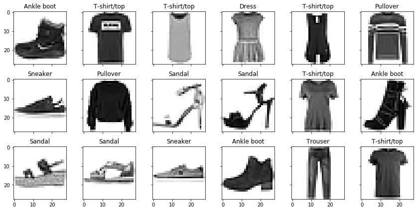
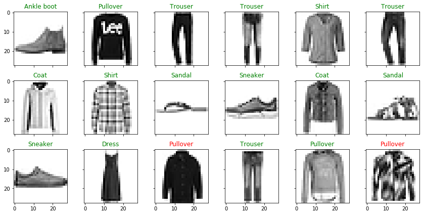

## Machine Learning Image Classification
I will use the Fashion MNIST data set obtained from https://github.com/zalandoresearch/fashion-mnist.  Each image is a 28x28 grayscale image corresponding to one of 10 different articles of clothing.  I will use tensorflow to create a machine learning model that classifies each image.

First, I import tensorflow and the other libraries needed.


```python
from __future__ import absolute_import, division, print_function, unicode_literals
import tensorflow as tf
import numpy as np
import matplotlib.pyplot as plt
```

Now I load in the clothing data set.  Then the data is split into the images that are going to be used for training the model, and then the images that will be used to test the model.


```python
fashion_mnist = tf.keras.datasets.fashion_mnist
(train_images, train_labels), (test_images, test_labels) = fashion_mnist.load_data()
```

Next, the 28x28 grayscale matrix representation of each image need to be normalized to have a range from 0 to 1.  Thus, we need to take all of the images and divide by the amount of possible grayscale shades.


```python
train_images = train_images / 255.0
test_images = test_images / 255.0
```

Before training the model, we need to create a list of the 10 possible clothing items a picture can be.


```python
class_names = ['T-shirt/top', 'Trouser', 'Pullover', 'Dress', 'Coat',
               'Sandal', 'Shirt', 'Sneaker', 'Bag', 'Ankle boot']
class_dict = {i: class_names[i] for i in range(len(class_names))}
```

Before building the model, here is an example of the training data set with the correct clothing classification. 


```python
f, ax = plt.subplots(3, 6, sharex=True, sharey=True, figsize=(12, 6))
for i in range(3):
    for j in range(6):
        ax[i][j].imshow(train_images[i*6+j], cmap=plt.cm.binary)
        title = ax[i][j].set_title(class_dict[train_labels[i*6+j]])
        ax[i][j].set_axis_off
plt.tight_layout()
```





It is time to create the model and train it with the training images.  The model will first flatten the input images so that instead of each imaging being a 28x28 matrix, it will be a vector of length 28^2.  Then two dense layers are added to the model with the ReLU and softmax activiation function respectively.


```python
model = tf.keras.models.Sequential([
    tf.keras.layers.Flatten(input_shape=(28,28)),
    tf.keras.layers.Dense(128, activation='relu'),
    tf.keras.layers.Dense(10, activation='softmax')
])
```

Now that we have the model, we need to train it.  To train, we will use the Adam optimizer and the sparse categorical crossentropy loss function.  We will run through the training data 5 times (epochs).


```python
model.compile(
    optimizer='adam',
    loss='sparse_categorical_crossentropy',
    metrics=['accuracy']
)

model.fit(train_images, train_labels, epochs=5)
```

    Epoch 1/5
    1875/1875 [==============================] - 2s 993us/step - loss: 0.4935 - accuracy: 0.8272
    Epoch 2/5
    1875/1875 [==============================] - 2s 1ms/step - loss: 0.3700 - accuracy: 0.8657
    Epoch 3/5
    1875/1875 [==============================] - 2s 1ms/step - loss: 0.3348 - accuracy: 0.8773
    Epoch 4/5
    1875/1875 [==============================] - 2s 1ms/step - loss: 0.3086 - accuracy: 0.8862
    Epoch 5/5
    1875/1875 [==============================] - 2s 1ms/step - loss: 0.2926 - accuracy: 0.8918
    


    <tensorflow.python.keras.callbacks.History at 0x1e743abe828>


On the fifth epoch, we achieved around 89% accuracy. We do not want to overtrain our model, so five epochs is enough.  Now it is time to use our model to feed in the test images that it has not yet seen to see how well it predicts the clothing classification. 


```python
test_loss, test_acc = model.evaluate(test_images, test_labels, verbose=2)
```

    313/313 - 0s - loss: 0.3768 - accuracy: 0.8658
    

We achieved 86.7% accuracy on the test data.  We can display the test images and the model's classification as the title.  If the model guessed incorrect, it will be labeled as read.


```python
y = model.predict(test_images)
f, ax = plt.subplots(3, 6, sharex=True, sharey=True, figsize=(12, 6))
for i in range(3):
    for j in range(6):
        ax[i][j].imshow(test_images[i*6+j], cmap=plt.cm.binary)
        title = ax[i][j].set_title(class_dict[y[i*6+j].argmax()])
        plt.setp(title, color = ('g' if y[i*6+j].argmax() == test_labels[i*6+j] else 'r'))
        ax[i][j].set_axis_off
plt.tight_layout()
```




