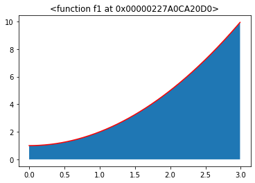
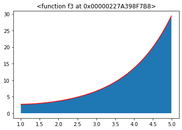
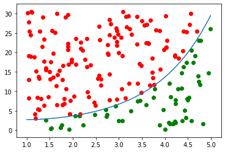

# A Simple Monte Carlo Integration Simulation Model

A simple implementation of approximating the value of integrals using Monte Carlo simulation is presented.  Uniform random numbers are generated to produce random points within a specified domain of the given function, and the ratio of points under the curve to total number of points is used to numerically approximate the definite integral.  After implementing the model, a short analysis is performed to analyze the trade-offs between number of trials vs number of points generated with regards to time complexity and accuracy.  For the sake of visualization, this model is limited to functions of one variable.

First, the necessary packages are imported.  Random is imported to allow us to generate uniform random numbers.  Numpy allows us to use arrays.  Time allows us to recored the runtime of the model.  Matplotlib will be used to visualize our functions.  Pandas will be used for dataframes.


```python
import random 
import numpy as np
import time
import matplotlib.pyplot as plt
import pandas as pd
```

First, three functions (all with $f(x)\geq 0 \; \forall x$ in specified domain) are defined to test the model.  The first two functions can easily be integrated by hand, where the third function cannot.  The first two functions can be used to test the accuracy of the model so we can trust the numerical approximation of the third function.  Another function is created to plot the functions given a domain, and to shade the area representing the integral we are trying to approximate with the model.

$I_1 = \int_0^3 (x^2 + 1) dx = 12$

$I_2 = \int_0^5 (sin(x) + x) dx = 13.22$

$I_3 = \int_1^5 (e^x/x) dx = ??$


```python
def f1(x):
    return x ** 2 + 1
```


```python
def f2(x):
    return np.sin(x) + x
```


```python
def f3(x):
    return np.exp(x)/x
```


```python
def plotFunction(f, a, b):
    x = np.arange(a, b, 0.01)
    plt.fill_between(x,f(x))
    plt.plot(x,f(x),'r')
    plt.title(str(f))
```


```python
plotFunction(f1, 0, 3)
```





```python
plotFunction(f2, 0, 5)
```


```python
plotFunction(f3, 1, 5)
```





Next, the Monte Carlo Model is defined.  As inputs, it takes the function to integrate, the lower and upper limits of integration, the number of simulation trials to run, the number of random points to generate per trial, and a boolean value to show the visualization.  The model uses the domain as the limits provided, and the range from 0 to the max of the function within the domain plus 1.  Thus, we have a rectangle with know width and height giving us the total area.  If we sample uniform random points within this rectangle, we can keep track of which points fall within the area under the curve.  The ratio of points under the curve to total points multiplied by the total area of the rectangle will give us an approximation of the area under the curve.  The same process is repeated in subsequent trials.  The average of all the trials is taken to produce the final answer.


```python
def MC(f, a, b, numTrials, numPoints, plot):
    start = time.time()
    x = np.arange(a, b, 0.01)
    y = f(x)
    maxy = max(y)+1
    domain = (b-a)
    totalArea = domain*maxy
    integrate = 0
    for t in range(numTrials):
        if plot and t == numTrials-1:
            plt.plot(x,y)
        numIn = 0
        for i in range(numPoints):
            xr = random.choice(x)
            yr = maxy*random.random()
            index = np.where(x == xr)
            if yr < y[index]:
                numIn += 1
                if plot and t == numTrials-1:
                    plt.scatter(xr,yr,c = 'g')
            elif plot and t == numTrials-1:
                plt.scatter(xr,yr,c = 'r')
        ratio = numIn/numPoints
        integrate += (totalArea*ratio)/numTrials
    totalTime = time.time()-start
    plt.show()
    return (integrate, totalTime)
```

Let's try evaluating $I_1$ to validate our model with 20 trials and 200 points.  I will also show the simulation from the last trial for visualization purposes.


```python
MC(f1,0,3,20,200,True)
```


    (11.9465892, 0.5519940853118896)


As seen, the green points are counted as below the curve, and the red points do not.  The output shows that the approximation was calculated as 11.95 in 0.55 seconds, which is very close to the real value of 12.  Let's try function 2.


```python
MC(f2,0,5,20,200,True)
```


    (13.243251140599687, 0.49567484855651855)


The approximation of 13.24 was calculated in less than half a second.  Another accurate approximation.  Now we can use the function to find $I_3$.


```python
MC(f3,1,5,20,200,True)
```





    (38.39262926414263, 0.39292073249816895)


We can be confident that $I_3 \approx 38.39$ in 0.39 computing time, even though we could not easily integrate the function by hand.

Now we can look at the trade-offs of increasing both the number of trials and number of sampled points per trial.  The below loop will use function 3 with the same limits while varying the trial and point numbers.


```python
timeArray = []
intArray = []
for trials in map(int,[10e0, 10e1, 10e2]):
    times = []
    ints = []
    for points in map(int, [10e1, 10e2, 10e3, 10e4]):
        (ans, tr) = MC(f3, 1, 5, trials, points, False)
        times.append(tr)
        ints.append(ans)
    timeArray.append(times)
    intArray.append(ints)

df_t = pd.DataFrame(timeArray)
df_i = pd.DataFrame(intArray)
```

Below shows the table correspoding to the solution, where the columns are the number of points from (10e1, 10e2, 10e3, 10e4) and the rows are the number of trials from (10e0, 10e1, 10e2).  As shown, the results are fairly accurate for all combinations.  The next table shows the runtime in seconds for the corresponding solutions.  As expected, the runtimes are exponential.


```python
df_i
```


<div>
<style scoped>
    .dataframe tbody tr th:only-of-type {
        vertical-align: middle;
    }

    .dataframe tbody tr th {
        vertical-align: top;
    }

    .dataframe thead th {
        text-align: right;
    }
</style>
<table border="1" class="dataframe">
  <thead>
    <tr style="text-align: right;">
      <th></th>
      <th>0</th>
      <th>1</th>
      <th>2</th>
      <th>3</th>
    </tr>
  </thead>
  <tbody>
    <tr>
      <th>0</th>
      <td>37.509690</td>
      <td>38.410897</td>
      <td>38.364619</td>
      <td>38.144432</td>
    </tr>
    <tr>
      <th>1</th>
      <td>37.850687</td>
      <td>38.116178</td>
      <td>38.182916</td>
      <td>38.185693</td>
    </tr>
    <tr>
      <th>2</th>
      <td>38.207517</td>
      <td>38.162700</td>
      <td>38.150266</td>
      <td>38.157989</td>
    </tr>
  </tbody>
</table>
</div>


```python
df_t
```


<div>
<style scoped>
    .dataframe tbody tr th:only-of-type {
        vertical-align: middle;
    }

    .dataframe tbody tr th {
        vertical-align: top;
    }

    .dataframe thead th {
        text-align: right;
    }
</style>
<table border="1" class="dataframe">
  <thead>
    <tr style="text-align: right;">
      <th></th>
      <th>0</th>
      <th>1</th>
      <th>2</th>
      <th>3</th>
    </tr>
  </thead>
  <tbody>
    <tr>
      <th>0</th>
      <td>0.012965</td>
      <td>0.057758</td>
      <td>0.506783</td>
      <td>5.489725</td>
    </tr>
    <tr>
      <th>1</th>
      <td>0.046834</td>
      <td>0.515505</td>
      <td>5.324434</td>
      <td>54.783333</td>
    </tr>
    <tr>
      <th>2</th>
      <td>0.714774</td>
      <td>5.352070</td>
      <td>56.713138</td>
      <td>550.195054</td>
    </tr>
  </tbody>
</table>
</div>


