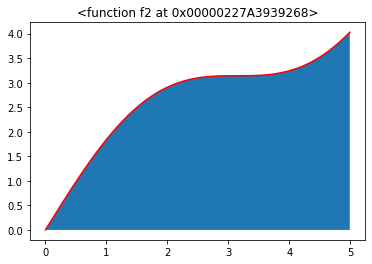
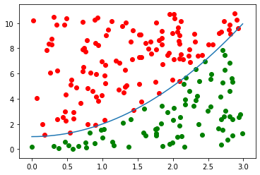

# A Simple Monte Carlo Integration Simulation Model

A simple implementation of approximating the value of integrals using Monte Carlo simulation is presented.  Uniform random numbers are generated to produce random points within a specified domain of the given function, and the ratio of points under the curve to total number of points is used to numerically approximate the definite integral.  After implementing the model, a short analysis is performed to analyze the trade-offs between number of trials vs number of points generated with regards to time complexity and accuracy.  For the sake of visualization, this model is limited to functions of one variable.

First, the necessary packages are imported.  Random is imported to allow us to generate uniform random numbers.  Numpy allows us to use arrays.  Time allows us to recored the runtime of the model.  Matplotlib will be used to visualize our functions.  Pandas will be used for dataframes.


```python
import random 
import numpy as np
import time
import matplotlib.pyplot as plt
import pandas as pd
```

First, three functions (all with $f(x)\geq 0 \; \forall x$ in specified domain) are defined to test the model.  The first two functions can easily be integrated by hand, where the third function cannot.  The first two functions can be used to test the accuracy of the model so we can trust the numerical approximation of the third function.  Another function is created to plot the functions given a domain, and to shade the area representing the integral we are trying to approximate with the model.

f1 = (x^2 + 1) integrated from 0 to 3 equals 12

f2 = (sin(x) + x) integrated from 0 to 5 equals 13.22

f3 = (e^x/x) integrated from 1 to 5 equals ??


```python
def f1(x):
    return x ** 2 + 1
```


```python
def f2(x):
    return np.sin(x) + x
```


```python
def f3(x):
    return np.exp(x)/x
```


```python
def plotFunction(f, a, b):
    x = np.arange(a, b, 0.01)
    plt.fill_between(x,f(x))
    plt.plot(x,f(x),'r')
    plt.title(str(f))
```


```python
plotFunction(f1, 0, 3)
```


```python
plotFunction(f2, 0, 5)
```





```python
plotFunction(f3, 1, 5)
```


Next, the Monte Carlo Model is defined.  As inputs, it takes the function to integrate, the lower and upper limits of integration, the number of simulation trials to run, the number of random points to generate per trial, and a boolean value to show the visualization.  The model uses the domain as the limits provided, and the range from 0 to the max of the function within the domain plus 1.  Thus, we have a rectangle with know width and height giving us the total area.  If we sample uniform random points within this rectangle, we can keep track of which points fall within the area under the curve.  The ratio of points under the curve to total points multiplied by the total area of the rectangle will give us an approximation of the area under the curve.  The same process is repeated in subsequent trials.  The average of all the trials is taken to produce the final answer.


```python
def MC(f, a, b, numTrials, numPoints, plot):
    start = time.time()
    x = np.arange(a, b, 0.01)
    y = f(x)
    maxy = max(y)+1
    domain = (b-a)
    totalArea = domain*maxy
    integrate = 0
    for t in range(numTrials):
        if plot and t == numTrials-1:
            plt.plot(x,y)
        numIn = 0
        for i in range(numPoints):
            xr = random.choice(x)
            yr = maxy*random.random()
            index = np.where(x == xr)
            if yr < y[index]:
                numIn += 1
                if plot and t == numTrials-1:
                    plt.scatter(xr,yr,c = 'g')
            elif plot and t == numTrials-1:
                plt.scatter(xr,yr,c = 'r')
        ratio = numIn/numPoints
        integrate += (totalArea*ratio)/numTrials
    totalTime = time.time()-start
    plt.show()
    ans = "Integral evaluates to = " + str(round(integrate,3)) + ", in " + str(round(totalTime,3)) + " seconds."
    return (ans)
```

Let's try running the simulation on function 1 to validate our model with 20 trials and 200 points.  I will also show the simulation from the last trial for visualization purposes.


```python
MC(f1,0,3,20,200,True)
```





    'Integral evaluates to = 11.979, in 0.458 seconds.'


As seen, the green points are counted as below the curve, and the red points do not.  The output shows that the approximation was calculated as 11.979 in 0.458 seconds, which is very close to the real value of 12.  Let's try function 2.


```python
MC(f2,0,5,20,200,True)
```


    'Integral evaluates to = 13.168, in 0.453 seconds.'


The approximation of 13.168 was calculated in less than half a second.  Another accurate approximation.  Now we can use the function to find the unknown approximation for the integration of function 3.


```python
MC(f3,1,5,20,200,True)
```


    'Integral evaluates to = 38.119, in 0.449 seconds.'


We can conclude that function 3 integrates to approximately 38.1 in only 0.45 seconds of computing time, even though we could not easily integrate the function by hand.
