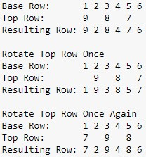

# Brute Force Solution to Safe Cracker Puzzle

## The Puzzle

To view or purchase the puzzle, click [here](https://www.amazon.com/Creative-Crafthouse-Safecracker-Difficult-Puzzles/dp/B08GCTFKV2).

The objective of the puzzle is to rotate the 4 movable discs in such a way that each of the 16 columns sum to the target of 50.  Since there are 16 different positions for each movable disc, the number of possibilities are $4^{16} = 65,536$ different possible combinations.

## Solving the Puzzle

In order to solve the puzzle through brute force, we need to be able to model the puzzle as a matrix and its rotation mechanism as a transformation on the matrix.  The numbers that go around the disc will be the rows of the matrix.

Since the movable discs have only 8 numbers each with a space between each number, we will define two types of rows.  The $base$ matrix will store the discs that do not rotate and have all 16 numbers.  The $top$ matrix will store the discs that do rotate and only have 8 numbers.

Depending on the position of the $top$ discs, 8 of the $base$ numbers will be covered by the $top$ numbers for a each row index.  Below shows a mini example of a roation.



Since the top row either covers the even or odd indexed columns, $top$_$index$ will be a vector where index $i = 0$ if the top row covers the even indexed columns and $1$ otherwise. 


```python
import numpy as np

base = np.array([
    [8, 4, 15, 7, 10, 1, 10, 4, 5, 3, 15, 16, 4, 7, 0, 16],
    [13, 10, 18, 10, 10, 10, 10, 15, 7, 19, 18, 2, 9, 27, 13, 11],
    [24, 8, 10, 20, 7, 20, 12, 1, 10, 12, 22, 0, 5, 8, 5, 1],
    [0, 22, 19, 10, 0, 5, 20, 8, 19, 10, 15, 20, 12, 20, 13, 13],
    [8, 17, 4, 20, 4, 14, 4, 5, 1, 14, 10, 17, 10, 5, 6, 18]
    ])

top = np.array([
    [10, 8, 10, 9, 8, 8, 9, 6],
    [10, 11, 10, 0, 11, 8, 8, 8],
    [14, 11, 8, 12, 11, 3, 8, 10],
    [6, 6, 8, 8, 16, 19, 8, 17]
    ])

top_index = np.zeros(len(top))

target = 50
```

The below funtion simply takes the $top$ matrix, and adds zeros where there are the resulting gaps.


```python
def ApplyTopGaps(top):
    
    newtop = []
    for r in top:
        newr = []
        for i in r:
            newr += [i, 0]
        newtop.append(newr)
    newtop = np.array(newtop)
    
    return newtop
```


```python
top
```


    array([[10,  8, 10,  9,  8,  8,  9,  6],
           [10, 11, 10,  0, 11,  8,  8,  8],
           [14, 11,  8, 12, 11,  3,  8, 10],
           [ 6,  6,  8,  8, 16, 19,  8, 17]])


```python
top = ApplyTopGaps(top)
```


```python
top
```


    array([[10,  0,  8,  0, 10,  0,  9,  0,  8,  0,  8,  0,  9,  0,  6,  0],
           [10,  0, 11,  0, 10,  0,  0,  0, 11,  0,  8,  0,  8,  0,  8,  0],
           [14,  0, 11,  0,  8,  0, 12,  0, 11,  0,  3,  0,  8,  0, 10,  0],
           [ 6,  0,  6,  0,  8,  0,  8,  0, 16,  0, 19,  0,  8,  0, 17,  0]])


The below function takes our $base$ and $top$ matrices along with the location of each top row to create a single matrix representation of the current state of the puzzle in matrix form.  Lastly, it checks if each column sums to the target.


```python
def GenerateBoard(base, top, top_index, target = 50):
    
    board = np.copy(base)
    for j in range(1,len(base)):
        board[j] = [0 if not i % 2 - top_index[j - 1] else x for i, x in enumerate(base[j])]
        board[j] += top[j - 1]
        
    board_sum = np.sum(board, axis = 0)
    
    #print(board_sum)
    
    flag = all(board_sum == target)
        
    return board, flag
```

The below functions rotate the $top$ rows and its corresponding $base$ rows.


```python
def Rotate(top, top_index, N):
    
    newtop = np.copy(top)
    newindex = np.copy(top_index)
    row = 0
    for n in N:
        if n % 2 == 1:
            if newindex[row] == 0:
                newindex[row] = 1
            else:
                newindex[row] = 0
        newtop[row] = np.roll(newtop[row], n)
        row += 1
    
    return newtop, newindex

def RotateBase(base, N):
    
    newbase = np.copy(base)
    row = 2
    for n in N[:-1]:
        newbase[row] = np.roll(newbase[row], n)
        row += 1
    
    return newbase
```

Lastly, the driver function takes all of our input and iterates over each possible combination until finding the solution.


```python
def Driver(base, top, top_index, target = 50):
    
    top_rows = len(top)
    columns = range(len(top[0])+1)
    comb = [(a,b,c,d) for a in columns for b in columns for c in columns for d in columns]
    
    flag = False
    i = 1
    
    while not flag:
        c = list(comb[i])
        #print("Iteration " + str(i))
        #print(c)
        newtop, newindex = Rotate(top, top_index, c) 
        newbase = RotateBase(base, c)
        newboard, flag = GenerateBoard(newbase, newtop, newindex, target)   
        i += 1
        
    if flag:
        print("Solution found at iteration " + str(i))
            
    return newboard, c
```


```python
import time

start = time.time()
solution, rotations = Driver(base, top, top_index, target)
end = time.time()

print("Runtime = " + str(round(end - start, 2)) + " seconds.")
```

    Solution found at iteration 57339
    Runtime = 11.41 seconds.
    


```python
solution
```


    array([[ 8,  4, 15,  7, 10,  1, 10,  4,  5,  3, 15, 16,  4,  7,  0, 16],
           [13,  9, 18,  8, 10,  8, 10,  9,  7,  6, 18, 10,  9,  8, 13, 10],
           [20,  0,  1, 11, 12,  8,  0,  8,  8,  8,  1, 10,  8, 11, 20, 10],
           [ 3, 20,  8, 19, 10, 15, 14, 12, 11, 13,  8,  0, 12, 19, 11,  0],
           [ 6, 17,  8,  5,  8, 18, 16, 17, 19, 20,  8, 14, 17,  5,  6, 14]])


```python
np.sum(solution, axis = 0)
```


    array([50, 50, 50, 50, 50, 50, 50, 50, 50, 50, 50, 50, 50, 50, 50, 50])


```python
rotations
```


    [11, 11, 6, 14]


The solution shows us the matrix representation of the solved puzzle, and the rotations variable tells us how many times we need to rotate the $top$ discs from the original position to arrive at the solution.
