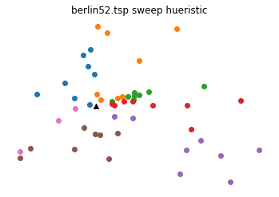
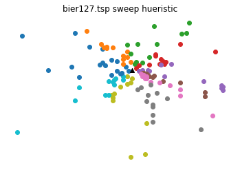
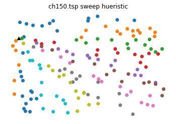

# Sweep Heuristic for the Vehicle Routing Problem

Problem Description: Given a set of customers and a fixed number of trucks, find the truck routes that minimizes the total distance traveled such that between all the trucks, each customer is visited.

Solution Method: Since the Vehicle Routing Problem is NP-Hard, a sweep heuristic will be used.  For the sake of generalization, let K = cieling(sqrt(number of customers).  Then it will be assumed that our fleet consists of K trucks, and each truck will visit the nearest customer clockwise to its location up to K customers.  The next truck route will start where the last truck route ended and continue (until all customers are visited).  The "depot" will be assumed to be the first location in the instance.

Import packages


```python
import math
import numpy as np
import matplotlib.pyplot as plt
import time
```

Function that takes cartesian coords and returns polar coords


```python
def cart2pol(x, y):
    rho = np.sqrt(x**2 + y**2)
    phi = np.arctan2(y, x)
    return(rho, phi)
```

Function that takes cartesian coords and returns distance between the two


```python
def distance(x,y):
    return math.sqrt(sum([(a - b) ** 2 for a, b in zip(x, y)]))
```

Define the Sweep Function


```python
def sweepVRP(instance):
    # start time and read in .tsp file of instance provided
    # two different formats for instances:
    start_time = time.time()
    infile = open(instance, 'r')
    infile.readline()
    if instance == "bier127.tsp":
        N = int(infile.readline().strip().split()[2])
        for i in range(4):
            infile.readline()
    elif instance == "berlin52.tsp" or instance == "ch150.tsp":
        infile.readline()
        N = int(infile.readline().strip().split()[1])
        for i in range(3):
            infile.readline()
    
    # create lists to store nodes, locations, and if visited
    nodelist = [infile.readline().strip().split() for i in range(N)]
    nodelist = [[int(nodelist[i][0])-1,float(nodelist[i][1]),float(nodelist[i][2])] for i in range(len(nodelist))]
    location = [(float(nodelist[i][1]),float(nodelist[i][2])) for i in range(N)]
    visited = [False for i in range(N)]
    visited[0] = True
    
    # displace coordinates with v0 as origin
    home_cart = location[0]
    new_location = [(location[i][0]-home_cart[0], location[i][1]-home_cart[1]) for i in range(len(location))]
    
    # convert coords to polar
    polar = []
    for i in range(len(new_location)):
        polar.append(cart2pol(new_location[i][0],new_location[i][1]))
    
    # def k' and b as defined in assignment
    k_prime = math.ceil(math.sqrt(N-1))
    b = k_prime
    k = 1
    
    # start loop by visiting visiting next node based off smallest clockwise angle to current node
    trucks = []
    d = 0
    # loop for each truck and for when we have unvisited nodes
    while all(visited) == False and k < k_prime:
        # find nodes and polar coords that are unvisited to consider
        indices = [i for i, x in enumerate(visited) if x == False]
        unvisit_polar = [polar[i] for i in indices]
        combined = [(indices[i],unvisit_polar[i][1]) for i in range(len(indices))]
        angles = [polar[i][1] for i in indices]
        closest = min(angles, key=lambda x:abs(x-(math.pi*2)))
        s = angles.index(closest)
        cur = combined[s][0]
        cur_angle = combined[s][1]
        count = 1
        visited[cur] = True
        route = [cur]
        # calc distance from home city to first node
        d += distance(location[0],location[cur])
        
        # loop for single truck while under b limit and have unvisited
        while count < b and all(visited) == False:
            # find node closest to cur by smallest angle change clockwise
            # move to this node and calc distance
            old_cur = cur
            indices = [i for i, x in enumerate(visited) if x == False]
            unvisit_polar = [polar[i] for i in indices]
            combined = [(indices[i],unvisit_polar[i][1]) for i in range(len(indices))]
            angles = [polar[i][1] for i in indices]
            displaced_angles = [cur_angle - angles[i] for i in range(len(angles))]
            for i in range(len(displaced_angles)):
                if displaced_angles[i] < 0:
                    displaced_angles[i] = 10
            closest = min(angles, key=lambda x:abs(x-(cur_angle)))
            s = angles.index(closest)
            cur = combined[s][0]
            cur_angle = combined[s][1]
            count += 1
            visited[cur] = True
            route.append(cur)
            d += distance(location[old_cur],location[cur])

        # add distance from end node for truck back to home city
        d += distance(location[cur],location[0])
        k += 1
        trucks.append(route)
        t = time.time() - start_time
    return(trucks,t,d,new_location)
```

Function for printing the solution


```python
def plot_solution(new_location, trucks, instance):
    for j in range(len(trucks)):
        x = [new_location[i][0] for i in trucks[j]]
        y = [new_location[i][1] for i in trucks[j]]
        plt.scatter(x, y)
    plt.scatter(0,0,marker = '^',color = "black", label = "home")
    plt.title(instance + " sweep hueristic")
    plt.axis('off')
    plt.show()
```

Test instances of TSP can be found at: http://elib.zib.de/pub/mp-testdata/tsp/tsplib/tsp/index.html
Each color represents one truck's assigned customer.  The black triangle is the depot.

Run and solve Berlin52 Instance


```python
b52, t52, d52, n52 = sweepVRP("berlin52.tsp")
plot_solution(n52, b52, "berlin52.tsp")
print("-- berlin52.tsp sweep solution --")
print("berlin52 solution found in %f seconds with distance %f" % (t52,d52))
for i in range(len(b52)):
    print("Truck %g visits customers:" %(i) )
    print(b52[i])
```





    -- berlin52.tsp sweep solution --
    berlin52 solution found in 0.007978 seconds with distance 20759.628277
    Truck 0 visits customers:
    [16, 21, 17, 2, 40, 18, 7, 44]
    Truck 1 visits customers:
    [8, 31, 9, 48, 42, 32, 38, 39]
    Truck 2 visits customers:
    [14, 37, 35, 3, 4, 5, 50, 23]
    Truck 3 visits customers:
    [36, 34, 47, 10, 33, 24, 11, 27]
    Truck 4 visits customers:
    [51, 45, 26, 12, 25, 43, 13, 46]
    Truck 5 visits customers:
    [15, 28, 49, 19, 29, 22, 1, 41]
    Truck 6 visits customers:
    [6, 20, 30]
    

Run and solve Bier127 Instance


```python
b127, t127, d127, n127 = sweepVRP("bier127.tsp")
plot_solution(n127, b127, "bier127.tsp")
print("-- bier127.tsp sweep solution --")
print("bier127 solution found in %f seconds with distance %f" % (t127,d127))
for i in range(len(b127)):
    print("Truck %g visits customers:" %(i) )
    print(b127[i])
```





    -- bier127.tsp sweep solution --
    bier127 solution found in 0.018946 seconds with distance 360157.541644
    Truck 0 visits customers:
    [126, 92, 102, 43, 44, 106, 53, 93, 1, 56, 110, 47]
    Truck 1 visits customers:
    [50, 117, 45, 111, 52, 48, 46, 120, 55, 4, 123, 49]
    Truck 2 visits customers:
    [54, 51, 65, 12, 64, 114, 112, 98, 88, 99, 9, 91]
    Truck 3 visits customers:
    [63, 57, 119, 124, 6, 90, 2, 60, 61, 89, 103, 59]
    Truck 4 visits customers:
    [115, 58, 10, 113, 8, 104, 109, 84, 85, 66, 86, 87]
    Truck 5 visits customers:
    [5, 7, 23, 70, 105, 22, 108, 71, 72, 95, 18, 3]
    Truck 6 visits customers:
    [107, 69, 67, 14, 21, 73, 68, 20, 118, 16, 17, 19]
    Truck 7 visits customers:
    [76, 74, 62, 75, 77, 83, 80, 78, 116, 125, 81, 79]
    Truck 8 visits customers:
    [82, 101, 11, 100, 30, 26, 31, 13, 28, 25, 24, 32]
    Truck 9 visits customers:
    [29, 121, 27, 37, 40, 38, 33, 97, 96, 42, 41, 122]
    Truck 10 visits customers:
    [15, 35, 36, 39, 94, 34]
    

Run and solve Ch150 Instance


```python
ch150, t150, d150, n150 = sweepVRP("ch150.tsp")
plot_solution(n150, ch150, "ch150.tsp")
print("-- ch150.tsp sweep solution --")
print("ch150 solution found in %f seconds with distance %f" % (t150,d150))
for i in range(len(ch150)):
    print("Truck %g visits customers:" %(i) )
    print(ch150[i])
```





    -- ch150.tsp sweep solution --
    ch150 solution found in 0.017952 seconds with distance 35670.262629
    Truck 0 visits customers:
    [81, 94, 106, 4, 142, 99, 102, 141, 84, 17, 96, 131, 136]
    Truck 1 visits customers:
    [64, 74, 49, 101, 54, 69, 134, 57, 107, 113, 85, 25, 98]
    Truck 2 visits customers:
    [97, 82, 18, 28, 140, 145, 80, 1, 55, 5, 36, 109, 8]
    Truck 3 visits customers:
    [6, 24, 27, 123, 41, 46, 89, 119, 19, 138, 45, 39, 7]
    Truck 4 visits customers:
    [50, 91, 83, 52, 137, 92, 125, 53, 108, 32, 117, 23, 35]
    Truck 5 visits customers:
    [11, 60, 42, 68, 133, 34, 88, 10, 126, 147, 66, 115, 104]
    Truck 6 visits customers:
    [129, 51, 100, 38, 110, 95, 16, 130, 31, 65, 37, 56, 59]
    Truck 7 visits customers:
    [40, 22, 29, 76, 132, 116, 139, 15, 121, 128, 58, 13, 143]
    Truck 8 visits customers:
    [14, 26, 48, 146, 79, 71, 120, 78, 77, 30, 144, 33, 122]
    Truck 9 visits customers:
    [93, 111, 87, 135, 62, 63, 73, 9, 20, 112, 12, 43, 105]
    Truck 10 visits customers:
    [70, 47, 114, 149, 44, 90, 127, 124, 118, 67, 148, 3, 61]
    Truck 11 visits customers:
    [2, 103, 21, 72, 75, 86]
    


```python

```
