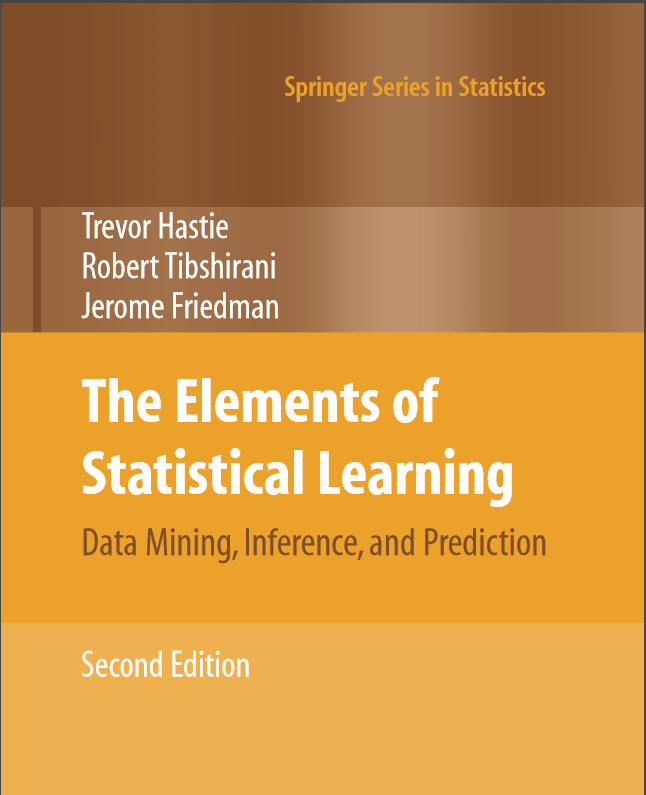
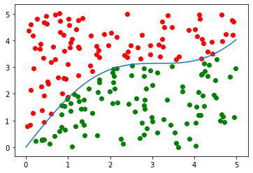

## Posts

---

### Implementation of Models in ***The Elements of Statistical Learning***

[Chapter 2: Supervised Learning](/ElementsOfStatisticalLearning/Chapter2/ElementsOfStatisticalLearning2.html)

---

### Optimization Algorithms 

<a href="https://masonweld.github.io/optimization/index.html">Optimization Models</a>

[Optimization Models](/optimization/index.html)

---

[Implementing the Simplex Algorithm](/Simplex/simplex.md)

---

[Solving Cutting Stock Problem with Column Generation](/Column_Generation/cutting_stock.md)

---

[Sweep Heuristic for the Vehicle Routing Problem](/Sweep/VRP_Sweep.md)

---
[Sudoku Solver](/Sudoku_Solver/Sudoku_Solver.md)

---
[Eight Queens Problem](/eight_queens/eight_queens.md)

---
[Change Problem](/Change_Problem/change.md)

---
[Nearest Neighbor](/nn_tsp/nn_tsp.md)

### SQL Data Querying and Algorithms

[Google's Page Rank Algorithm in T SQL](/PageRank/PageRank.md)

---

### Statistical Models

<a href="https://masonweld.github.io/MonteCarlo/index.html">A Simple Monte Carlo Integration Model</a>

[Report: Markov Chains and its Applications to Golf](/Markov_Chain_Golf/Markov Chains and its Applications to Golf.pdf)

---

### Machine Learning

[Clothing Image Classification](/Image_ML/image_ml.md)

