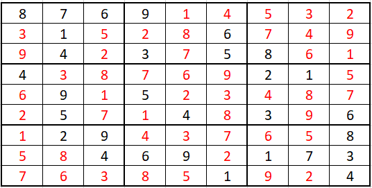
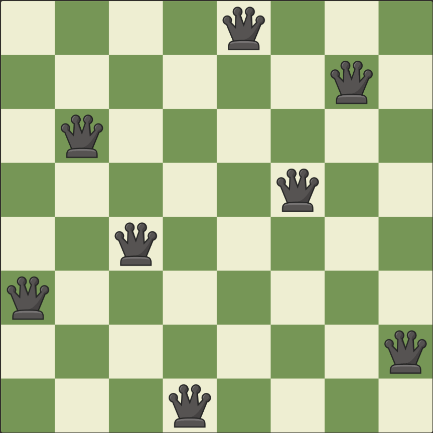
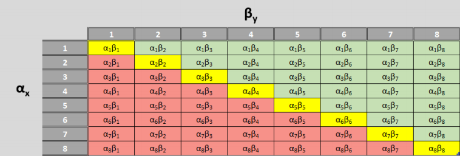

## Posts

---

### Optimization Algorithms 

[Implementing the Simplex Algorithm](/Simplex/simplex.md)

---

[Solving Cutting Stock Problem with Column Generation](/Column_Generation/cutting_stock.md)

---

[Sweep Heuristic for the Vehicle Routing Problem](/Sweep/VRP_Sweep.md)

---
[Sudoku Solver](/Sudoku_Solver/Sudoku_Solver.md)

---
[Eight Queens Problem](/eight_queens/eight_queens.md)

---
[Change Problem](/Change_Problem/change.md)

---
[Nearest Neighbor](/nn_tsp/nn_tsp.md)

---

### Data Projects

[Outputting User Performance Stats from LiChess Database](/Chess_Games/chess_games.md)

---

### SQL Data Querying and Algorithms

[Google's Page Rank Algorithm in T SQL](/PageRank/PageRank.md)

---

### Statistical Models

[A Simple Monte Carlo Integration Model](/MonteCarlo/MonteCarloIntegration.md)

[Report: Markov Chains and its Applications to Golf](/Markov_Chain_Golf/Markov Chains and its Applications to Golf.pdf)

<a href="https://masonweld.github.io/testHTML/index.html">test</a>
---

### Machine Learning

[Clothing Image Classification](/Image_ML/image_ml.md)

