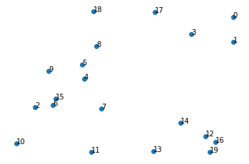
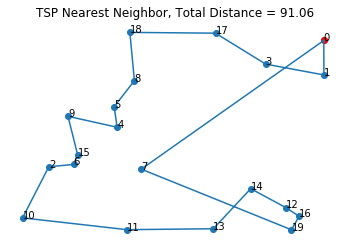
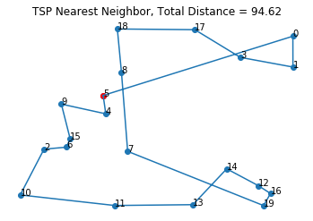
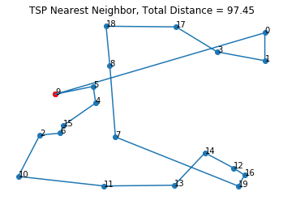
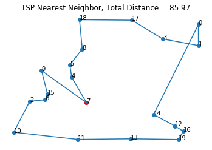

# Symmetric Traveling Salesman Problem: A Simple Nearest Neighbor Heuristic


```python
import math
import timeit
import numpy as np
import matplotlib.pyplot as plt
from prettytable import PrettyTable

N = 20
arr = 20*np.random.rand(N,2)

n = range(N)
plt.scatter(arr[:,0], arr[:,1])
plt.axis('off')
for i, txt in enumerate(n):
    plt.annotate(txt, (arr[i,0], arr[i,1]))

```





```python
def distance(x,y):
    return math.sqrt(((x[0]-y[0])**2)+((x[1]-y[1])**2))
```


```python
def nearest_neighbor(N,arr,start):
    visited = [False for i in range(N)]
    visited[start] = True
    location = arr[start]
    total_distance = 0
    route = [start]
    
    while all(visited) == False:
        not_visited = list(set(range(N))-set(route))
        dist = [distance(location,arr[i]) for i in not_visited]
        distance_dict = {k:v for (k,v) in zip(not_visited,dist)}
        min_index = min(distance_dict.keys(), key=(lambda k: distance_dict[k]))
        visited[min_index] = True
        total_distance += distance_dict[min_index]
        location = arr[min_index]
        route.append(min_index)
        
    route.append(start)
    total_distance += distance(location,arr[start])
    return(route, total_distance)

```


```python
for j in [0, 5, 9]:
    route, total_distance = nearest_neighbor(N,arr,j)
    x_plot = [arr[i,0] for i in route]
    y_plot = [arr[i,1] for i in route]
    plt.figure()
    plt.scatter(arr[:,0], arr[:,1])
    plt.scatter(arr[j,0], arr[j,1], color = "red")
    for i, txt in enumerate(n):
        plt.annotate(txt, (arr[i,0], arr[i,1]))
    plt.plot(x_plot,y_plot)
    plt.axis('off')
    plt.title("TSP Nearest Neighbor, Total Distance = " + str(round(total_distance,2)))
```











```python
def best_NN(arr,N,display):
    if display == True:
        T = PrettyTable()
        T.field_names = ["Starting Node", "Distance"]
    best_route_distance = math.inf
    total_distance_list = []
    start = timeit.default_timer()
    for i in range(N):
        r, d = nearest_neighbor(N,arr,i)
        if display == True:
            T.add_row([i,round(d,2)])
        if d < best_route_distance:
            best_route_distance = d
            best_route = r
    stop = timeit.default_timer()
    run_time = stop-start
    print(T)
    return best_route, best_route_distance, run_time

best_route, best_route_distance, run_time = best_NN(arr,N,True)
print('Best Route List: ', best_route)
print('RunTime: ', run_time)
```

    +---------------+----------+
    | Starting Node | Distance |
    +---------------+----------+
    |       0       |  91.06   |
    |       1       |   89.4   |
    |       2       |  90.57   |
    |       3       |  89.58   |
    |       4       |  94.65   |
    |       5       |  94.62   |
    |       6       |  95.66   |
    |       7       |  85.97   |
    |       8       |  89.58   |
    |       9       |  97.45   |
    |       10      |  90.57   |
    |       11      |  93.07   |
    |       12      |  99.54   |
    |       13      |  98.14   |
    |       14      |   96.3   |
    |       15      |  96.01   |
    |       16      |  101.13  |
    |       17      |  94.82   |
    |       18      |  89.58   |
    |       19      |  98.13   |
    +---------------+----------+
    Best Route List:  [7, 4, 5, 8, 18, 17, 3, 1, 0, 14, 12, 16, 19, 13, 11, 10, 2, 6, 15, 9, 7]
    RunTime:  0.020500499999798194
    


```python
x_plot = [arr[i,0] for i in best_route]
y_plot = [arr[i,1] for i in best_route]
plt.scatter(arr[:,0], arr[:,1])
for i, txt in enumerate(n):
    plt.annotate(txt, (arr[i,0], arr[i,1]))
plt.plot(x_plot,y_plot)
plt.scatter(arr[best_route[0],0], arr[best_route[0],1], color = "red")
plt.axis('off')
plt.title("TSP Nearest Neighbor, Total Distance = " + str(round(best_route_distance,2)))
```


    Text(0.5, 1.0, 'TSP Nearest Neighbor, Total Distance = 85.97')





